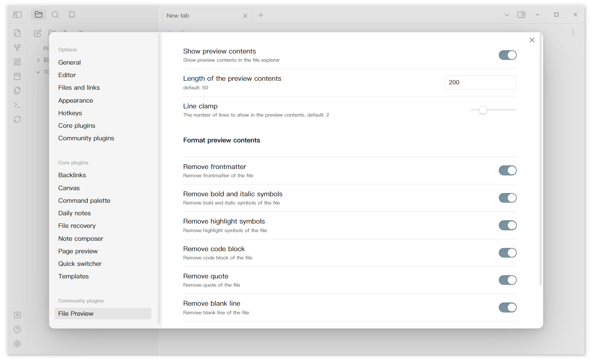

# Overview

Add file preview contents under markdown file's title in file explorer.

Overall screenshot

Detail screenshot

Setting screenshot

This plugins will only add preview contents to existing files. If you create new files, you need to click the refresh botton on the left ribbon.